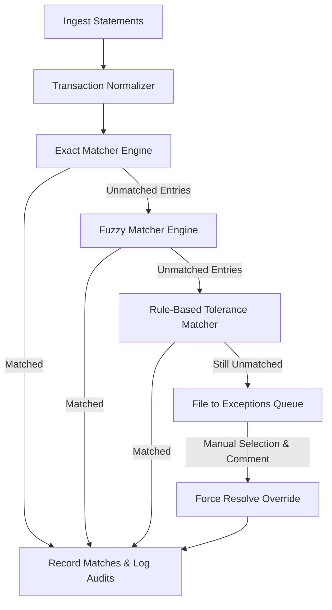

# Automated Reconciliation Engine

An enterprise-grade, high-performance financial reconciliation engine designed to ingest multi-format bank statement entries, normalize them, apply configurable match logic (exact, fuzzy, and rule-based), and surface manual overrides and audit histories.

---

## Key Modules & Features

### 🏦 Bank Statement Parsers (`backend/app/services/parser/`)
* **MT940 Parser**: Robust SWIFT MT940 bank statement format parser extracting tags like `:61:` (Statement Line) and `:86:` (Information to Account Owner).
* **CAMT.053 XML Parser**: High-fidelity parser extracting bank transaction details from standard ISO 20022 XML messages.
* **CSV Parser**: Custom CSV engine mapping arbitrary banking tables (Value Date, Post Date, Amount, Currency, Reference, Description) to uniform structures.

### ⚙️ Reconciliation Matching Pipeline (`backend/app/services/matching/`)
* **Transaction Normalizer**: Formats arbitrary ledger transactions and raw bank logs into standard schemas.
* **Exact Matcher**: Resolves transactions matching 1:1 across amounts, currencies, and specific identification details.
* **Fuzzy Matcher**: Employs rapid-fuzz distance calculations on metadata and descriptions when alphanumeric matching codes are incomplete or mistyped.
* **Rule-Based Engine**: Supports chained tolerance checks (e.g., date offsets of +/- N days, FX exchange rate tolerances).

### 🛡️ Security, Auditing & Exception Management
* **JWT Auth Service**: Lock down APIs using secure access tokens with OAuth2 Bearer standards.
* **Exceptions Queue**: Active queue for transactions that fail automatic matching. Provides a workspace for manual override, pairing, and adjustments with strict logs.
* **Immutable Audit Trail**: Records system actions (uploading, running reconciliation, matching transactions, resolving exceptions) to secure database tables.

---

## Technology Stack

* **Backend Engine**: Python 3.10+, FastAPI (Asynchronous framework), SQLAlchemy ORM, Pydantic v2.
* **Frontend Interface**: Streamlit (Reactive dashboard), Plotly (Interactive visualizations).
* **Data Storage**: PostgreSQL.
* **Containerization**: Docker, Docker Compose.

---

## Directory Layout

```text
.
├── backend/                  # FastAPI Core Backend Service
│   ├── app/
│   │   ├── api/              # Versioned API routes & schemas
│   │   ├── db/               # PostgreSQL session & base models
│   │   ├── middleware/       # Custom logging and error handling
│   │   ├── models/           # SQLAlchemy database tables
│   │   ├── schemas/          # Pydantic validation serializers
│   │   ├── services/         # Parsing & matching services
│   │   ├── config.py         # App configurations via env
│   │   └── security.py       # JWT/OAuth2 Authentication helper
│   ├── Dockerfile
│   └── requirements.txt
├── frontend/                 # Streamlit UI Dashboard Service
│   ├── app.py                # Dashboard application entry point
│   ├── pages/                # Multi-page dashboard layouts
│   ├── components/           # Client APIs and reusable elements
│   ├── assets/               # CSS overrides for premium style
│   ├── Dockerfile
│   └── requirements.txt
├── docker-compose.yml        # Service orchestrator configuration
├── .env.example              # Template for environment settings
└── .gitignore
```

---

## Quick Start Configuration

### 1. Environment Setup
Clone the configuration sample and set up your active environment variables:
```bash
cp .env.example .env
```
Ensure you generate a secure random secret for authentication:
```bash
openssl rand -hex 32
```
Paste this token in the `JWT_SECRET_KEY` property of your active `.env`.

### 2. Run with Docker Compose (Recommended)
Compile the image files and boot the database, engine backend, and user interface dashboard:
```bash
docker-compose up --build
```
* **FastAPI documentation**: [http://localhost:8000/docs](http://localhost:8000/docs)
* **Streamlit dashboard**: [http://localhost:8501](http://localhost:8501)

### 3. Run Locally (Alternative)
Ensure you have a running PostgreSQL database matching the configuration variables.

**Backend Service:**
```bash
cd backend
python -m venv venv
source venv/bin/activate  # Or `venv\Scripts\activate` on Windows
pip install -r requirements.txt
uvicorn app.main:app --reload --port 8000
```

**Streamlit Dashboard:**
```bash
cd frontend
python -m venv venv
source venv/bin/activate  # Or `venv\Scripts\activate` on Windows
pip install -r requirements.txt
streamlit run app.py --server.port 8501
```

---

## API Routes Documentation

| HTTP Method | Route | Description | Auth Required |
| :--- | :--- | :--- | :--- |
| `POST` | `/api/v1/auth/register` | Register a new administrator user. | No |
| `POST` | `/api/v1/auth/token` | Log in and obtain OAuth2/JWT access token. | No |
| `POST` | `/api/v1/transactions/upload` | Upload and parse MT940, CAMT.053, or CSV. | Yes |
| `GET` | `/api/v1/transactions` | Query and list ingested bank transactions. | Yes |
| `POST` | `/api/v1/reconciliation/run` | Trigger exact, fuzzy, or rule-based matching runs. | Yes |
| `GET` | `/api/v1/exceptions` | Retrieve the active unmatched exception queue. | Yes |
| `PUT` | `/api/v1/exceptions/{id}/resolve` | Manually match or force-reconcile transactions. | Yes |
| `GET` | `/api/v1/audit` | View full historical action audit trail logs. | Yes |

---

## Core Match Sequence Flowchart


